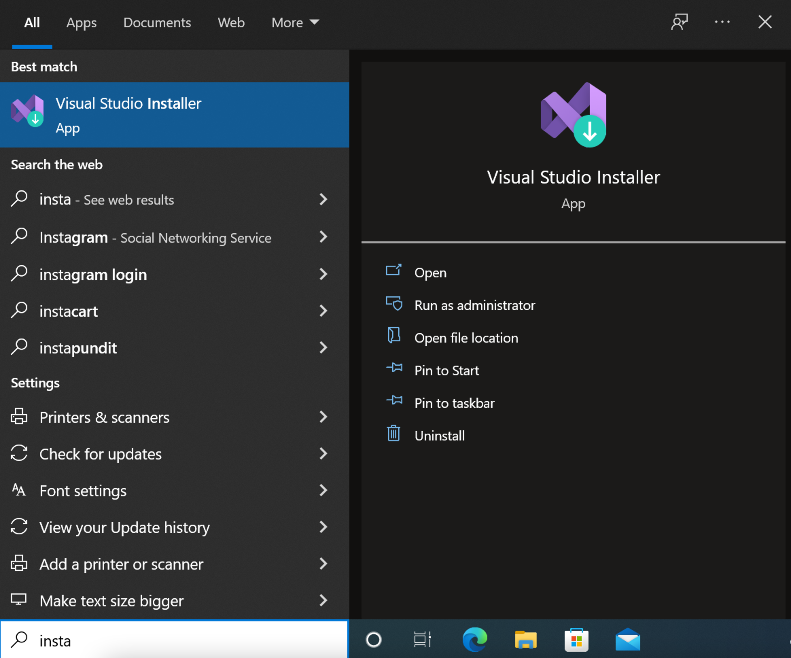
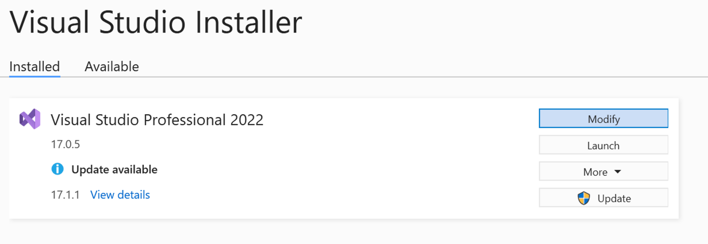
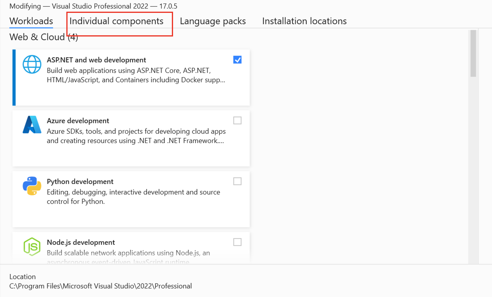
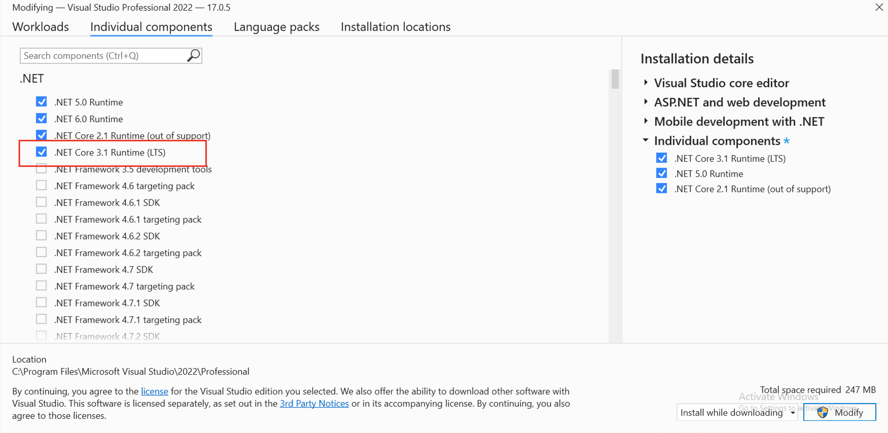
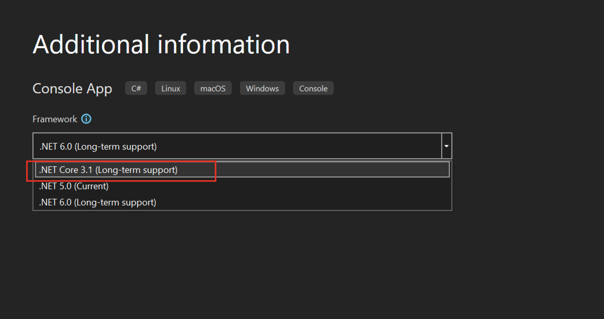

# .NET Core 3.1 Installation guide

## From the search in the task bar find the Visual Studio Installer and run it

## Click modify on your Visual Studio instance

## From the top tabs choose "Individual components"

## Check ".NET Core 3.1 Runtime (LTS)" and then click on "Modify"

## Wait for the installation to finish and afterwards you can close the Installer and when you open Visual Studio again .NET Core 3.1 will be available in the Console Application Template

