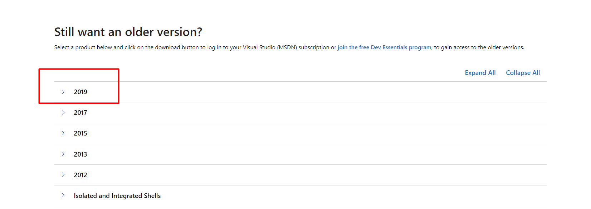
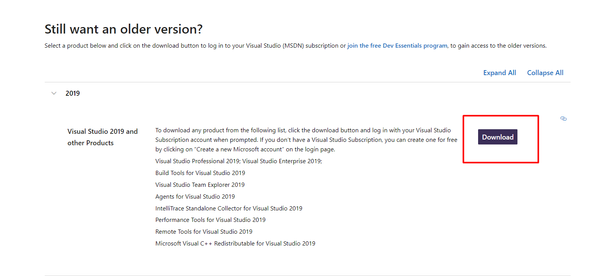
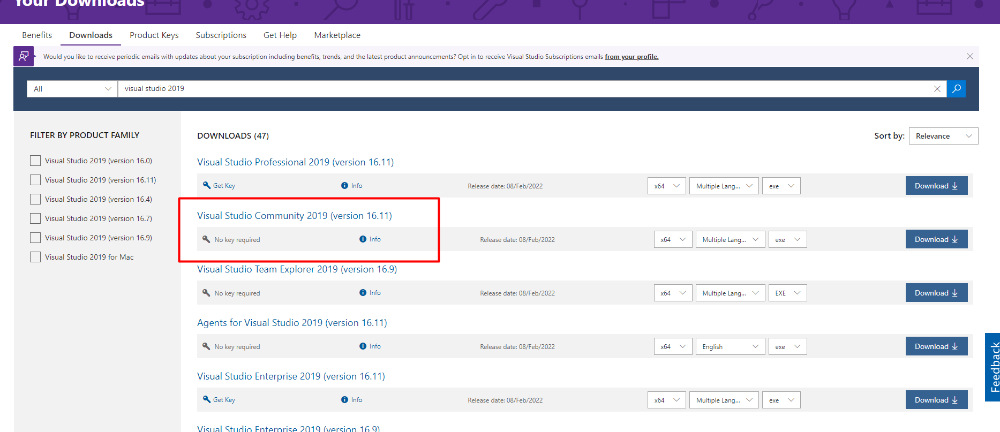

## How to install VS 2019 🎈
1. Download Visual Studio Community version from this link. Not: You have to be logged in with a Microsoft account (hotmail/outlook/live):

[Visual Studio Older Versions](https://visualstudio.microsoft.com/vs/older-downloads/)

Then follow the instructions from [this step further](https://github.com/sedc-codecademy/skwd10-net-05-oopcsharp/blob/main/VisualStudio.md#:~:text=Check%20ASP.NET%20and%20web%20development%20box%20(%20For%20later%20subjects%20))

## For Visual Studio 2022 you need .NET Core 3.1. You can find it [here](https://dotnet.microsoft.com/en-us/download/dotnet/3.1). Install SDK.

